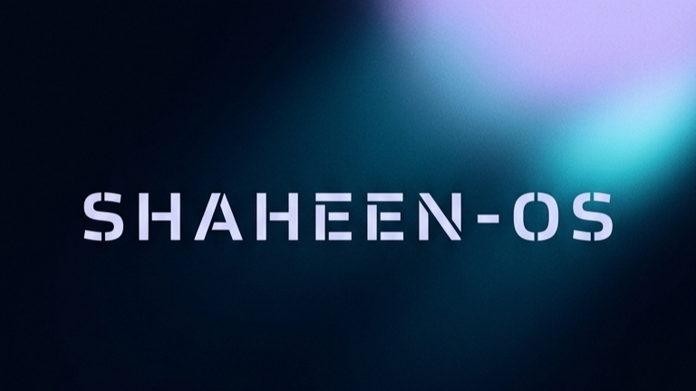
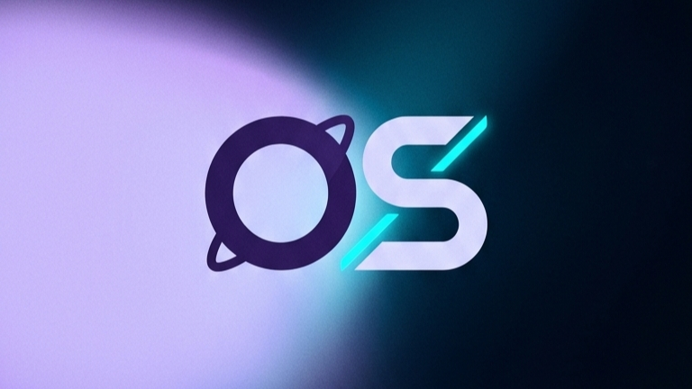

<table width="100%">
<tr>
<td align="center" width="50%">

 

<strong>SHAHEEN-OS</strong>

 

<strong>Fly High, Code Free.</strong>

</td>
<td align="center" width="50%">

 

<strong>SHAHEEN-OS</strong>

 

<strong>Fly High, Code Free.</strong>

</td>
</tr>
</table>

---

🚀 SHAHEEN-OS

SHAHEEN-OS is an open-source Android application store client derived from the Aurora Store project.

It provides a modern interface for searching, viewing and downloading Android applications available through Google Play services while maintaining the open-source nature and architectural principles of the original project.

SHAHEEN-OS is developed and maintained by:

> Yousef Z. A. Shaheen

Project Information

Information	Details

Project	SHAHEEN-OS
Platform	Android
Project Type	Open-Source Android Application
License	GNU General Public License v3.0
Developer	Yousef Z. A. Shaheen
Rebranding	SHAHEEN-OS
Project Launch / Rebranding Date	21 September 2026
Original Project	Aurora Store
Source Model	Open Source
Primary Language	Kotlin / Android
UI	Material Design / Material 3
Repository	SHAHEEN-OS
Domain	shaheen94s.mooo.com

---

🌌 About

SHAHEEN-OS provides an Android application-store experience that allows users to:

Search for Android applications.

View application information.

View descriptions.

View screenshots.

View application updates.

View reviews when supported.

Download APK files.

Manage application downloads.

Use anonymous or authenticated access where supported.

Change device and locale information where supported.

Check application compatibility.

Inspect application trackers through supported integrations.

SHAHEEN-OS does not own, license or independently distribute the applications displayed through the service.

Application information and downloadable content are retrieved through the underlying services used by the application.

---

✨ Overview

SHAHEEN-OS is designed as an open-source Android client focused on providing a modern application-store interface while maintaining compatibility with the underlying Google Play ecosystem.

The project inherits significant functionality from Aurora Store and its upstream open-source ecosystem.

---

🎯 Vision

The vision of SHAHEEN-OS is to provide a modern, transparent and open-source Android application client with:

Modern Android design.

Simple application discovery.

Efficient downloading.

Privacy-conscious functionality.

Open-source development.

Transparent project documentation.

Community participation.

Long-term maintainability.

---

💡 Mission

The mission of SHAHEEN-OS is to continue developing an accessible Android application client while preserving the principles of free and open-source software.

---

🔥 Highlights

🚀 Modern Android application client

🎨 Material 3 inspired interface

🔓 Open-source development

🔐 Privacy-conscious architecture

📦 APK download management

🔎 Application search

📱 Device and locale spoofing

🌍 Geo-availability support where provided

🧩 Privacy and compatibility integrations

🔄 Application update management

👤 Anonymous account support

🔑 Google account support

🛠 Manual APK version downloads

📚 Open documentation

🤖 AI-assisted development workflow

---

⭐ Features

🔎 Application Search

Search for applications available through the underlying Google Play services.

📱 Application Information

View supported application metadata including:

Application name

Description

Screenshots

Version information

Updates

Reviews

Compatibility information

👤 Account Login

SHAHEEN-OS supports account-based access where supported by the underlying services.

Anonymous access is also available for supported functionality.

🌍 Device & Locale Spoofing

The application can provide device and/or locale spoofing functionality to access applications according to the capabilities of the underlying service.

🕵️ Privacy Information

Supported privacy integrations can provide information about trackers detected in applications.

🔄 Updates

Application updates can be discovered and managed through the application.

📥 Download Manager

SHAHEEN-OS includes download management functionality for supported APK downloads.

🕰️ Manual Downloads

Older application versions can be downloaded when:

The requested version is available.

The underlying service provides access to that version.

The correct version code is known.

---

🧠 AI Capabilities

AI is used as a development assistance tool rather than as a required runtime component of the Android application.

AI assistance may be used for:

Code generation.

Code refactoring.

Documentation.

Debugging assistance.

Code review.

Development research.

Test development.

Repository maintenance.

All generated code must remain subject to human review, testing and maintenance.

---

🤖 Supported Models

SHAHEEN-OS does not require an AI model to operate as an Android application.

AI models used during development may change independently of the application.

No specific AI model is required for end users.

---

🔌 Integrations

The project inherits or supports integrations associated with the original Aurora Store ecosystem where those integrations remain compatible with the SHAHEEN-OS codebase.

Examples include:

Exodus Privacy

Plexus

Google Play services

microG-compatible environments where supported

---

🧩 Plugins

SHAHEEN-OS does not currently define a standalone plugin marketplace.

Additional integrations may be introduced through future development.

---

🛠 Tools

Development may involve:

Android Studio

Gradle

Kotlin

Git

GitHub / GitLab

Android SDK

Android Build Tools

ADB

Fastlane

CI/CD tooling

---

🏗 Architecture

SHAHEEN-OS is an Android application built around the architecture inherited from the Aurora Store project.

The application communicates with the underlying Google Play-related services and presents the retrieved application information through its Android user interface.

High-level architecture:

┌──────────────────────────────┐
│         SHAHEEN-OS           │
│       Android Client         │
└──────────────┬───────────────┘
               │
               ▼
┌──────────────────────────────┐
│      Application Services    │
│  Search / Metadata / Updates │
│      Download Management     │
└──────────────┬───────────────┘
               │
               ▼
┌──────────────────────────────┐
│      Google Play Services    │
│   Underlying Application API │
└──────────────┬───────────────┘
               │
               ▼
┌──────────────────────────────┐
│      Application Packages    │
│       Metadata / APKs        │
└──────────────────────────────┘
